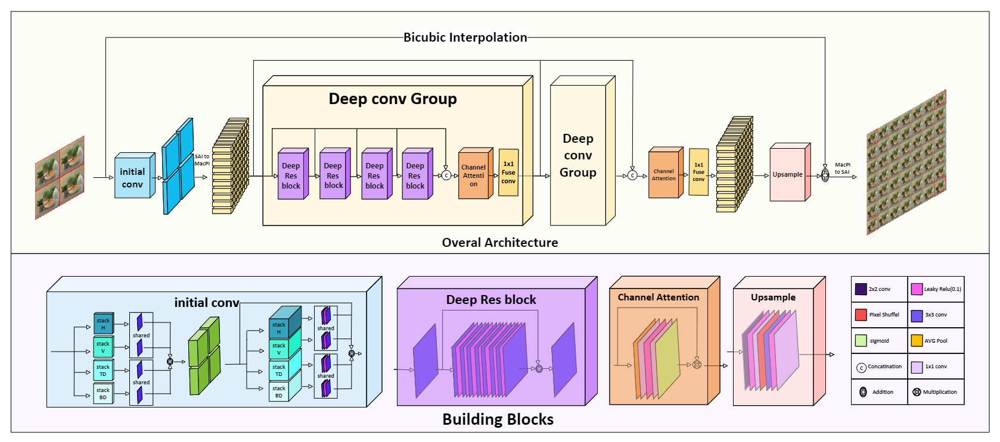

# LFASR-Qeg

Reconstructing Angular Light Field by Learning Spatial Features from  Quadrilateral Epipolar Geometry
Preparation:
1. Requirement:
PyTorch 2.0.1, torchvision 0.15.2. The code is tested with python=3.10.12, cuda=11.7.
Matlab for training/test data generation and performance evaluation.
2. Datasets:
We used the HCInew, HCIold, and STFgantry datasets for training and testing. Please first download datasets via [OneDrive](https://aunedu-my.sharepoint.com/:f:/g/personal/ebrahemelkady_aun_edu_eg/EuQrZMQaqulHvUGh_n9a5qoBef4tT3rccbR04vqu6ekDfA?e=Cn8lH8), and place the datasets in the folder `./Datasets/`.

# Data preparation
run GenerateTrainingData.m and GenerateTestData.m to generate training and test data.

# Evaluation
Set dataset in testset_dir option and run test.py.

# Training
Set options trainset_dir, andtestset_dir and run train.py 

# Acknowledgement
This repository benifit from [DistgASR](https://github.com/YingqianWang/DistgASR/tree/main), thanks for their open-source framework.
